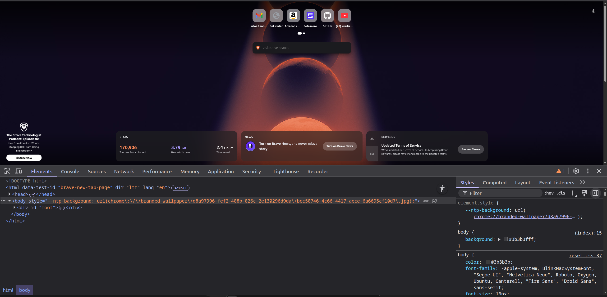
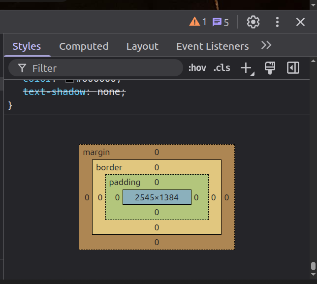
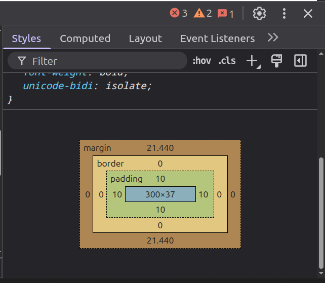
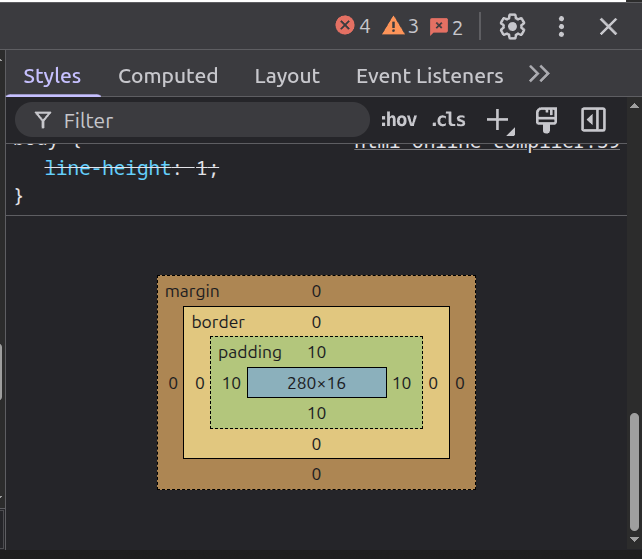
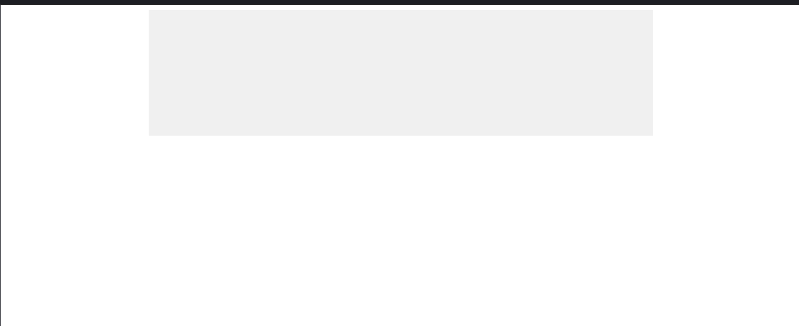

No  CSS, o termo "box model" é utilizado quando estamos falando sobre web design e layout.

O box model é literalmente uma caixa que envolve todos os elementos do HTML.

Toda box vai possuir 4 partes: o conteúdo (content), o espaçamento interno (padding), bordas (border) e o espaçamento externo (margin).

![[boxmodel|900]]*Em verde está o margin, em azul o padding e em branco o espaço do conteúdo*

- `Content`: O conteúdo, onde o texto ou imagem aparecem
- `Padding`: O espaçamento interno, entre o content e a border
- `Border`: A borda do elemento, fica entre o padding e o margin
- `Margin`: Espaçamento externo. Fica na área fora do border

O conceito de box model permite você adicionar largura (width), altura (height), borda nos elementos HTML, bem como espaçamentos internos, externos e entre elementos.

```css
div {
  width: 300px; /*Aqui definimos a largura do elemento*/
  border: 1px solid black; /*Aqui definimos a borda do elemento*/
  padding: 50px; /*Aqui estamos definindo o espaçamento interno, entre o conteudo e a borda*/
  margin: 20px; /*E aqui estamos definindo o espaçamento externo, que vai empurrar outros elementos que estiverem ao redor*/
}
```


#### O box-sizing

Por padrão, o valor da propriedade `box-sizing` é `content-box`. Isso quer dizer que quando adicionamos `width`, `padding` e `border`, o elemento terá o tamanho das três propriedades somadas juntas.

Pegando o exemplo anterior teríamos: 

![[boxmodelcalc| 1000]]

Esse comportamento pode quebrar o layout do site, visto que definimos o width para ter 300px fixo, mas com o valor padrão `content-box` ele soma tudo. Para resolver isso usaremos como valor o `border-box`. Com ele, a largura ficará exatamente a que definimos e não será alterada pelo padding e\ou border.

```css
/* O seletor * (asterisco) seleciona TODOS os elementos da página */
* {
  box-sizing: border-box; /*Esse é o valor moderno para essa propriedade*/
  }
```

Usando o mesmo exemplo anterior, ao invés de termos um elemento com 402px, teremos um elemento com largura fixa em 300px que não será alterada pelo padding e\ou border.

#### Inspecionar o Box Model do elemento

Para visualizar o box model dos elementos no HTML usaremos o inspecionar. Para acessar o inspecionar basta seguir um desses passos no navegador:

- Apertar F12;
- clicar com o botão direito e selecionar inspecionar;
- Apertar as teclas ctrl + shift+i

<div>
	
</div>

Ao abrir o inspecionar nos deparamos com essa tela, onde é possível ver o HTML da página, bem como o CSS.

Na aba da direita temos a parte de CSS. Na parte inferior teremos a parte do box model.

<div>
	
</div>

Nessa parte da aba `Style` podemos analisar o box model do elemento HTML.

```html
<!--index.html-->
<html>
  <head>
   <link rel="stylesheet" href="style.css">
  </head>
  <body>
    <h1>Este é um título</h1>
  </body>
</html>
```

```css
/* index.css */
h1 {
  width: 300px;
  padding: 10px;
}
```

Ao ver esse elemento `H1` com width e padding definidos veremos da seguinte forma no box model:


<div>
	  
</div>
*Aqui informa que o elemento tem 300px de largura e um padding de 10px em cada lado*

>[!TIPS] Dica
>Sempre use o `box-sizing: border-box` no inicio do CSS para não ocorrer problemas de layout

#### Reset CSS

Se prestarmos atenção notamos que existe uma margin no elemento `H1` que criamos, mas em nem um momento definimos essa margin. 

O que acontece é que cada navegador tem um valor padrão de margin e padding para cada elemento. Para resolver isso precisamos "resetar" o CSS.

Para isso, podemos pesquisar no google por "reset css". Vou utilizar esse link como exemplo: 
[reset css](https://meyerweb.com/eric/tools/css/reset/)

Esse link tem exatamente o que precisamos para tirar todos esses padrões dos navegadores e limpar o CSS.

Exemplo retirado do site acima:

```css
/* http://meyerweb.com/eric/tools/css/reset/ 
   v2.0 | 20110126
   License: none (public domain)
*/

*{
  box-sizing: border-box; /*Aqui definimos o box-sizing. Não estava presente no reset css*/
}

html, body, div, span, applet, object, iframe,
h1, h2, h3, h4, h5, h6, p, blockquote, pre,
a, abbr, acronym, address, big, cite, code,
del, dfn, em, img, ins, kbd, q, s, samp,
small, strike, strong, sub, sup, tt, var,
b, u, i, center,
dl, dt, dd, ol, ul, li,
fieldset, form, label, legend,
table, caption, tbody, tfoot, thead, tr, th, td,
article, aside, canvas, details, embed, 
figure, figcaption, footer, header, hgroup, 
menu, nav, output, ruby, section, summary,
time, mark, audio, video {
	margin: 0; /*zeramos a margin*/
	padding: 0;/*zeramos o padding*/
	border: 0;/*zeramos a borda*/
	font-size: 100%;
	font: inherit;
	vertical-align: baseline;
}
/* HTML5 display-role reset for older browsers */
article, aside, details, figcaption, figure, 
footer, header, hgroup, menu, nav, section {
	display: block;
}
body {
	line-height: 1;
}
ol, ul {
	list-style: none;
}
blockquote, q {
	quotes: none;
}
blockquote:before, blockquote:after,
q:before, q:after {
	content: '';
	content: none;
}
table {
	border-collapse: collapse;
	border-spacing: 0;
}
```

Apos incluir esse CSS no projeto:

<div>
	
</div>

>[!WARNING] Atenção
>Para incluir o reset CSS no projeto, por questões de organização, colocamos ele em um arquivo separado, geralmente chamado de reset.css. Ele deve ser incluído no head **ANTES** do arquivo css principal. Ficaria assim:


```html
<head>
 <link rel="stylesheet" href="reset.css">
 <link rel="stylesheet" href="style.css">
</head>
```

#### Centralizando elementos com `margin`

Se você definir a largura de um elemento e depois dizer para o navegador que as margens laterais do elemento são automáticas `auto`, o navegador vai centralizar o elemento.

```css
.container {
	width: 800px;      /* Precisa ter uma largura definida! */
    margin: 0 auto;    /* 0 em cima/baixo, AUTO nas laterais */
    height: 200px;     /*Definindo a altura do elemento*/
    background-color: #f0f0f0;
}
```

Resultado:

<div>
	
</div>

#### Desafio Prático

Crie uma div com classe .cartao

Defina width: 300px.
Adicione uma borda vermelha.

Objetivo A: Use padding para afastar o texto da borda vermelha.
Objetivo B: Use margin para centralizar esse cartão no meio da tela.