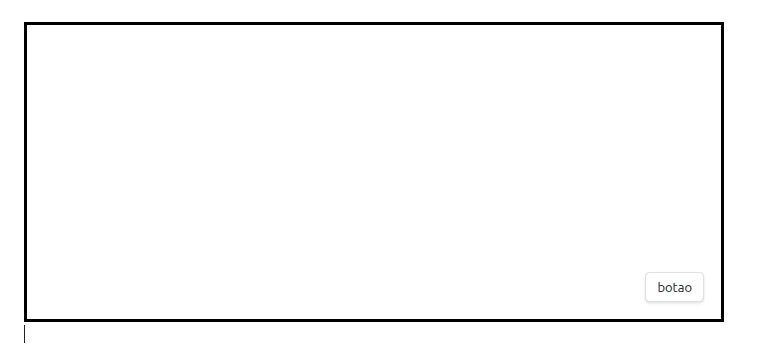
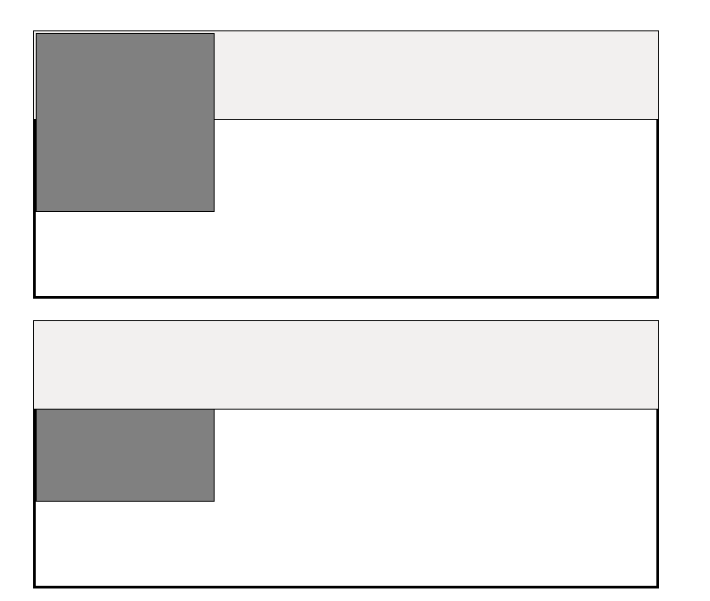

Com a propriedade `position` do CSS, nós conseguimos manipular a posição dos elementos no HTML. Com essa propriedade, nós podemos alterar o fluxo normal do documento.


Essa propriedade pode ter esses valores:

- `static`: Este é o valor padrão
- `relative`
- `fixed`
- `absolute`
- `sticky`

### CSS position: static

Todos os elementos CSS, por padrão, tem a `position` com valor `static`

Elementos posicionados com o valor `static` **não** são afetados pelas propriedades `top`, `right`, `left` e `bottom`.

Um elemento com esse posicionamento vai ser posicionado sempre de acordo com o fluxo normal do documento HTML

<div style="position:static;border:3px solid black;">
	<p>Esse elemento está com uma posição static</p>
</div>

Aqui o CSS usado :

```css
div {
  position: static;
  border: 3px solid black;
}
```
> [!INFO] Definição
> O valor `static` é o comportamento natural do HTML. O elemento apenas "segue a fila".

### CSS position: relative

Um elemento com o posicionamento `relative` fica posicionado de acordo com o fluxo do documento HTML.

A diferença entre o elemento posicionado com o valor `static` e `relative` é que o elemento com o `position: relative` é que ele vai aceitar as propriedades `top`, `right`, `left` e `bottom`. Essas propriedades movem o elemento a partir da sua posição original, mas o espaço que ele ocupava inicialmente continua reservado no fluxo do documento.

<div style="position:relative;left:30px;border:3px solid black;">
<p>Este elemento tem borda preta e posição relativa.</p>
</div>

Aqui o CSS usado: 

```css
div {
  position:relative;
  left:30px;
  border:3px solid black;
}
```

### CSS position: fixed


Um elemento com a `position: fixed` vai ficar posicionado relativamente ao Viewport, ou seja, a tela. Independentemente se você fizer o scroll do site ele vai permanecer fixado no local designado.

Esse elemento é removido do fluxo normal do HTML e não é criado um espaço reservado para ele, como acontece com `position: relative`.

Sua posição final é dita pelas propriedades `top`, `right`, `left` e `bottom`.

<div>
	
</div>


O elemento `button` nessa caixa está com um posicionamento fixado no canto inferior direito, e vai ficar nessa posição, independente de outro elemento

```css
div {
	width: 100%;
	height:300px;
	border:3px solid black;
}

div button {
	position:fixed;
	bottom:0px;
	right:0px;
	margin:20px
}
```

#### Z-INDEX

Quando estamos trabalhando com elementos com position definida, ou seja, diferente de `static`, temos um pequeno problema de sobreposição de elementos. Para resolver esse problema, temos a propriedade `z-index`.

O funcionamento da propriedade é simples, todos os elementos tem um valor padrão `auto`, e isso significa que os elementos seguirão o fluxo padrão. Mas, se colocar `z-index:1;` o elemento em questão vai empilhar o elemento um nível acima dos outros. 

> [!WARNING] Atenção
> Elementos com z-index definido "disputam" entre si. Isso significa que um elemento com `z-index: 1` fica atrás do elemento com `z-index: 2`, ou seja, quanto maior o `z-index`, mais mais **à frente** (ou mais no topo) o elemento ficará.

<div>
	
</div>

Neste exemplo eu tenho 1 div pai e 2 div´s filhas. A primeira div possui um position relative, com z-index 1. Já a segunda div tem um position fixed. No segundo exemplo, a primeira div não possui a propriedade z-index. Nota-se que a div com position fixed sai do elemento pai, esse comportamento nos mostra que quando um elemento tem position `fixed` ele vai se posicionar relativamente a tela do dispositivo e não a outros elementos.Além disso, visualmente, no Exemplo 1 o quadrado cinza ficou POR CIMA da barra branca (porque tem z-index maior), enquanto no Exemplo 2 ele ficou POR BAIXO (porque perdeu na ordem natural do HTML).

código dos 2 exemplos: 

```html
<!--Exemplo 1-->
<div style="height:300px;border:3px solid black;">
	<div style="width:200px;height:200px;border:1px solid black;position:relative;z-index:1;background-color:#808080">
	</div>
	<div style="width:100%;height:100px;border:1px solid black; position:fixed;top:0px;left:0px; background-color:#f2f0ef">
	</div>
</div>

<!--Exemplo 2-->
<div style="height:300px;border:3px solid black;">
	<div style="width:200px;height:200px;border:1px solid black;position:relative;background-color:#808080">
	</div>
	<div style="width:100%;height:100px;border:1px solid black; position:fixed;top:0px;left:0px; background-color:#f2f0ef">
	</div>
</div>
```


### CSS position: absolute

Frequentemente confundido com o `position:fixed`, o valor `absolute` também não vai ter um espaço reservado no fluxo normal de um documento HTML e também vai ficar fixo em um posicionamento determinado. A diferença entre ele e o position `fixed` é que o `absolute` vai se posicionar relativamente ao primeiro parente  com position diferente de `static`, se não existir, ele vai se posicionar relativamente ao elemento `root`, ou seja, ao elemento `<html>`.

> [!WARNING] Atenção
> O elemento com posição absoluta só vai funcionar em relação a um parente com posição diferente de `static` se forem ancestrais: pai, avô, e assim em diante. Tentar posicionar um elemento em relação a um irmão não funcionará.Portanto, para um elemento se posicionar em relação a outro, ele precisa estar **DENTRO** desse outro.


<html>
	<head>
	</head>
	<body>
		<div style="width:100%;height:400px;border:3px solid black;display:flex;justify-content:center;align-items:center;">
			<div style="width:300px;height:300px;border:3px solid black;position:relative;">
				<button style="position:absolute;top:0;right:0">
					click here
				</button>
			</div>
		</div>
	</body>
</html>

<html>
	<head>
	</head>
	<body>
		<div style="width:100%;height:400px;border:3px solid black;display:flex;justify-content:center;align-items:center;position:relative;">
			<div style="width:300px;height:300px;border:3px solid black;">
				<button style="position:absolute;top:0;right:0">
					click here
				</button>
			</div>
		</div>
	</body>
</html>

Como vocês podem ver no primeiro exemplo eu tenho uma div pai e um div filho, dentro dessa div eu tenho um button. Esse button está utilizando o `position:absolute` enquanto o seu pai, a div em que o botão está dentro possui a propriedade `position:relative`.  No segundo exemplo, eu removi a propriedade `position:relative` do elemento pai e ele se posicionou relativamente ao elemento mais externo e com position diferente de `static`. Como não existe, ele ficou posicionado na primeira div do documento.


### CSS position: sticky

A propriedade `position: sticky` funciona, de certa forma, de modo híbrido. Ela funciona como se fosse uma posição relativa e fixada ao mesmo tempo, dependendo do scroll da página.

Inicialmente ele se comporta como se tivesse com o `position: relative`, ele ocupa seu espaço natural e segue o fluxo. Quando é feito o scroll da página, o elemento atinge uma certa posição e gruda lá, assumindo assim uma posição fixa. A diferença dele para a position `fixed` é que quando o elemento pai some da tela, o elemento com position `sticky` segue o pai, já o fixed fica ali independente.

> [!WARNING] Regra Obrigatória 
> Para o `sticky` funcionar, você **PRECISA** definir pelo menos uma coordenada de "parada" (`top`, `bottom`, `left` ou `right`). Se você colocar apenas `position: sticky` sem dizer "aonde" ele deve grudar, ele não vai funcionar e agirá como um elemento normal (`static`).

```css
h1 {
    position: sticky;
    top: 0; /* OBRIGATÓRIO: define onde ele deve grudar */
    background-color: yellow;
}
```

