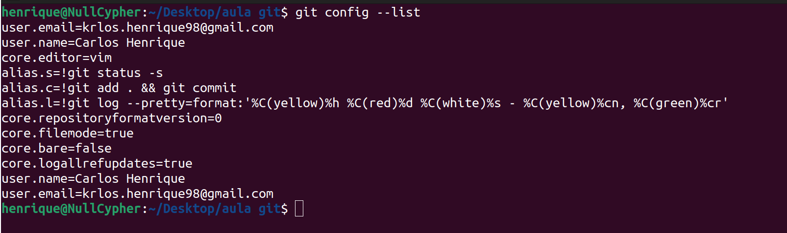

Antes de iniciarmos de fato a usar o git para versionar nossos projetos é necessário realizar uma configuração básica no git.

Para toda vez que salvamos o progresso do projeto no git, ele solicita que esteja configurado um Autor e um endereço de email para que ele possa rotular quem modificou o código.

>[!WARNING] Atenção
>O Git exige o nome do Autor e o e-mail para salvar o progresso (commit) do projeto. Isso garante a rastreabilidade e confiabilidade. Sem essa informação o git não permite salvar.

Para isso, dentro do terminal (cmd, prompt de comando, powershell) iremos passar o seguinte comando:

```bash
git config --global user.name "aqui você coloca o nome de usuário"
git config --global user.email "aqui você coloca o seu email"
```

Com esse comando nós estamos incluindo nas configurações do git um nome de usuário (autor) e um email. A flag --global indica que essa configuração vai ser compartilhada por todos os repositórios git que estiver no seu computador. Sem ela, a configuração só seria válida para o repositório que você está trabalhando no momento.

Para verificar se deu certo, basta usar o comando `git config --list` que ele listar as suas configurações:

<div>
	
</div>

> [!NOTE] Dica
>  Utilizar o mesmo email que você utiliza na sua conta do GitHub

