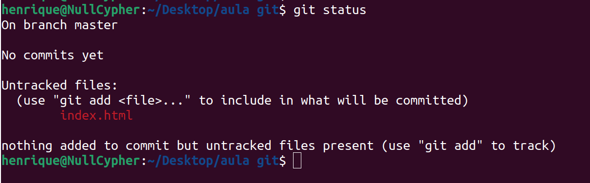
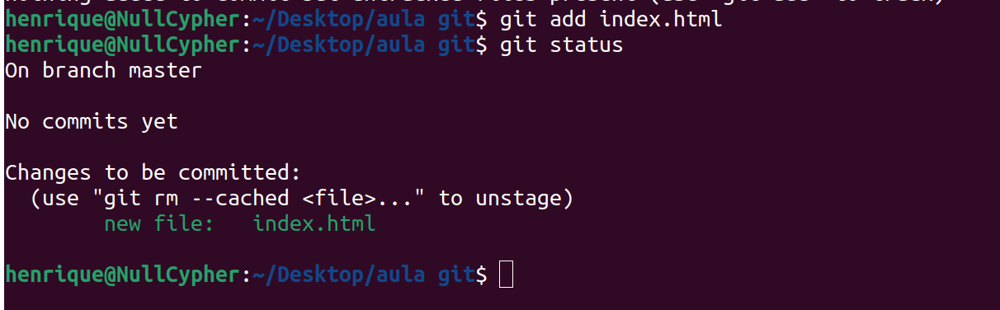
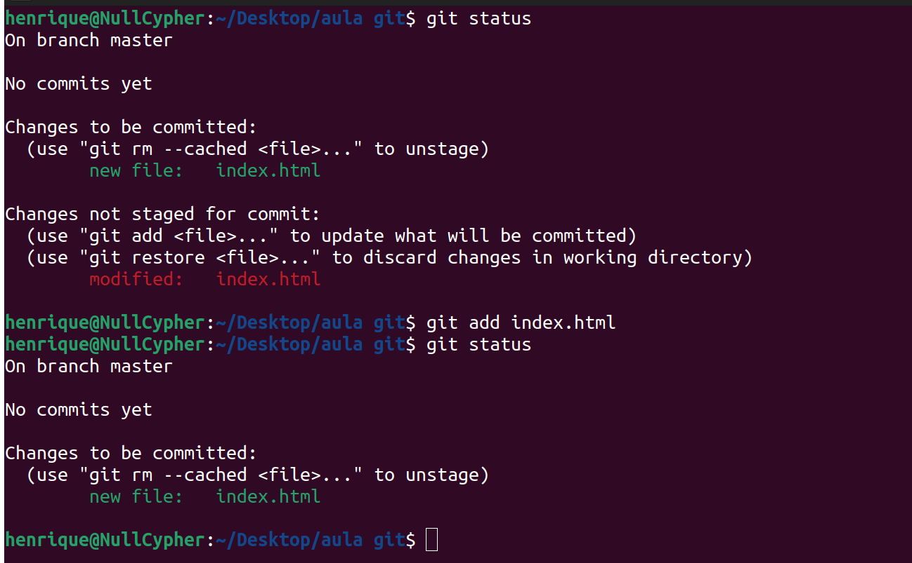
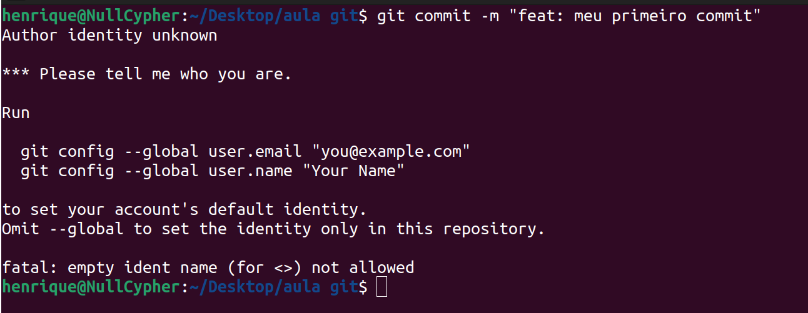
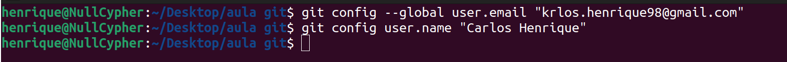
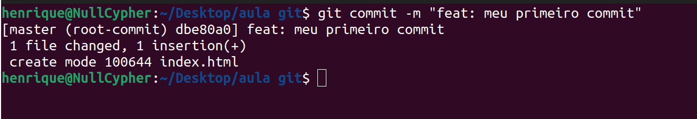
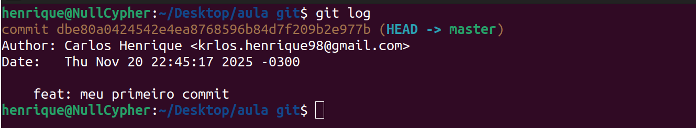

Antes de registrar as primeiras mudanças no repositório git é muito importante saber sobre o ciclo de vida dos arquivos em um repositório do git.

Para entendermos o ciclo dividimos os arquivos em 2 grupos: `tracked` (rastreado) e `untracked `(não rastreado). 

Arquivos `untracked` são os novos arquivos presente do diretório de trabalho que ainda não foram incluídos no git.

Arquivos `tracked` são aqueles que já foram salvos anteriormente no repositório git. Todo arquivo tracked pode ter 3 estados possíveis, `unmodified`, `Modified` e `Staged`.


<div>
	
</div>


Para verificar em qual estado o arquivo se encontra atualmente, basta usar o comando `git status`

```bash
$ git status
On branch master
Your branch is up-to-date with 'origin/master'.
nothing to commit, working tree clean
```

Isso significa que seu diretório de trabalho está limpo, ou seja, nenhum dos seus arquivos tracked estão modificados.

Agora vamos dizer que você adicionou um novo arquivo no diretório chamado index.html. Se esse arquivo não existisse antes no projeto, ao rodar `git status` ele fica assim

<div>
	
</div>

Você pode ver que o novo arquivo, `index.html` está `untracked` (não rastreado). Isso significa que o git vê o arquivo mas ele não existe em um snapshot (commit) anterior. 

Para começar a rastrear (tracking) o arquivo, você usa o comando `git add`.

```bash
git add
```

Se você rodar o comando `git status`, verá que o arquivo agora esta `tracked`  e pronto para ser commitado (staging area).

<div>
	
</div>

Nesse momento o próximo passo será usar o comando `git commit -m "mensagem de commit"` para completar o envio do arquivo para o banco de dados do git. Mas, caso haja alterações no arquivo, o arquivo ficará com status `modified` (modificado) e será necessário executar o comando `git add` novamente.

<div>
	
</div>

Quando finalizar com o arquivo e ele estiver finalizado, basta executar o comando `git commit -m "mensagem do commit"` para, por fim, salvar o arquivo.

<div>
	
</div>

Neste momento o git recusou o commit, pois não configuramos o autor daquele commit. Para isso, precisamos definir um nome de usuário e um email referente ao autor do commit.

Para isso, usamos o comando `git config --global user.name "nome de usuario"` e `git config --global user.email "email do usuario"`. A flag `--global` diz ao git que para todos os repositórios git deve-se usar essa configuração. Se não declarada, para cada repositório teremos que definir o nome de usuário e email.

Lembrando que o email cadastrado no git deve ser o mesmo email cadastrado no GiHub.

<div>
	
</div>

Para verificar se deu certo basta usar o comando `git config --list` para listar as configurações atuais do git.

<div>
	
</div>

E por fim, podemos concluir o commit do nosso projeto.

<div>
	
</div>

Para verificar se realmente o commit foi feito, bem como ver informações sobre outros commits já realizados durante o desenvolvimento do projeto, usamos o comando `git log` para ver tais informações.

<div>
	
</div>

O comando `git log` nos trás informações sobre quem fez o commit, nome de usuário e email, quando foi feito o commit e a mensagem deixada durante o comando `git commit`. 