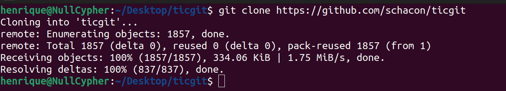
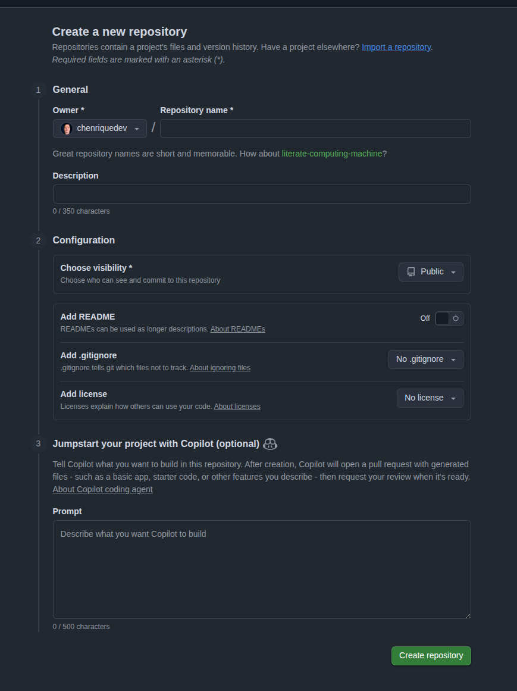
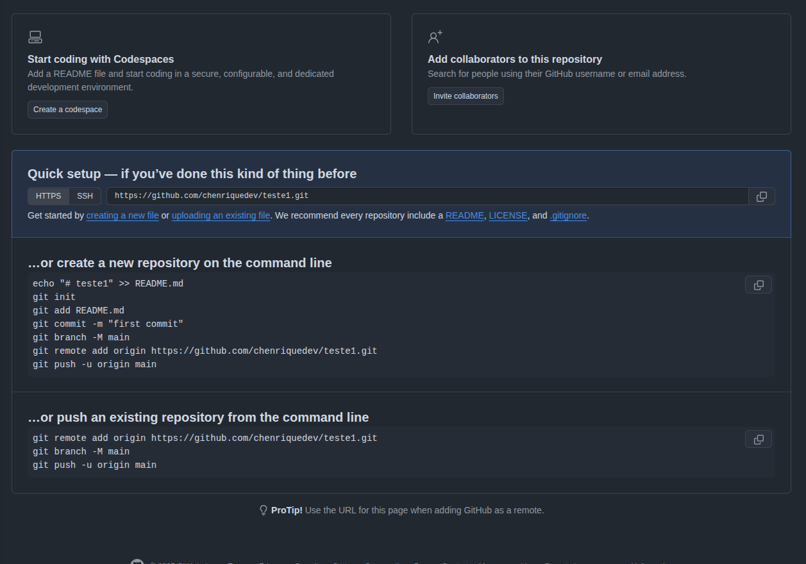
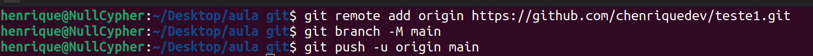
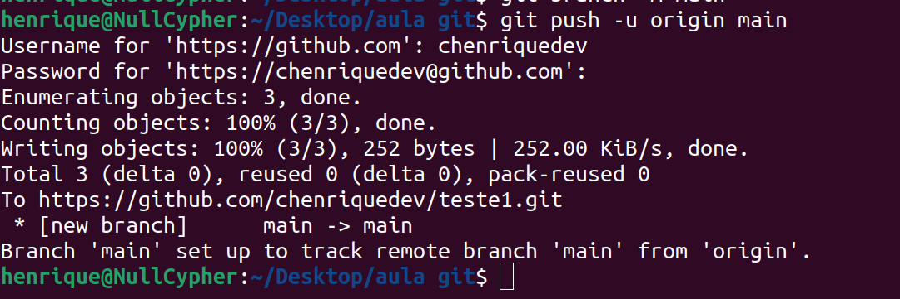
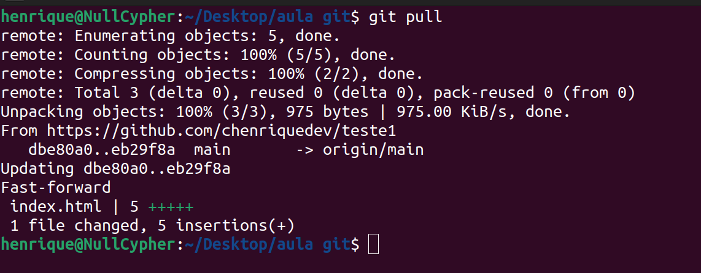

Para ser capaz de contribuir com algum projeto ou trabalhar em equipe,você precisa saber como administrar seus repositórios remotos. 

Repositórios remotos são versões do seu projeto que estão hospedadas na internet em algum lugar, geralmente no GitHub. 

Colaborar com outros repositórios envolve gerenciar esses repositórios remotos e enviar e receber dados deles quando for necessário compartilhar o trabalho.

### Clonar um repositório 

Para clonar um repositório existente de um sistema de hospedagem, como o GitHub, nós usamos o comando `git clone <url do repositório>`

	

### Adicionar repositório remoto a um repositório local

Quando usamos o `git clone`, ele já vem com o link do repositório remoto configurado. Para adicionar um repositório remoto a um projeto local, usamos o comando `git remote add <shortname> <url>`. Esse shortname é um apelido para o link que estamos configurando, geralmente chamamos de `origin`.

Para isso, precisamos entrar no site de hospedagem (irei usar o GitHub), para criar um novo repositório. Criar um repositório é simples, devemos ir em profile (perfil) -> repositories (repositórios) -> new (novo repositório).

	

Obrigatoriamente um novo repositório deve ter um nome e esse nome deve ser diferente de outros repositórios que você já tenha criado.

Quando criamos um repositório novo, o GitHub já nos fornece os códigos necessários para conectar o nosso repositório local ao remoto.

	

Considerando que nós já possuímos uma pasta com o diretório .git já criado com os arquivos já salvos (commitados), o próximo passo é copiar os 3 ultimos comandos que o GitHub nos fornece, abrir o terminal na pasta do projeto e rodar o comando.

	

Se você estiver dentro do terminal do vscode, ele vai pedir permissão para conectar a sua conta do GitHub, autorize e no fim ele vai enviar seu projeto para o repositório remoto.

	

### Atualizar os dados locais com o remoto

Durante a colaboração entre desenvolvedores em repositórios remotos, é comum que o código seja atualizado constantemente. Para puxar essas atualizações para nosso repositório local, usamos dois comandos : `git fetch` e o `git pull`.

O `git fetch` baixa as informações e commits do repositório remoto, mas NÃO une as informações no seu diretório de trabalho, apenas atualiza o banco de dados local.

Para mesclar as informações, usamos um comando chamado `git merge` para unificar as informações que vieram do repositório remoto com o diretório de trabalho atual.

Já o `git pull` ele é uma união dos 2 comandos, `git fecth` e `git merge`, ele baixa as informações e automaticamente une o código que você baixou com o código do seu diretório de trabalho.

##### exemplo:
Eu alterei o arquivo que estava no GitHub mas não atualizei essa alteração com meu dispositivo local. Para que eu consiga trazer essas informações e unir ao meu código local, irei usar o comando `git pull`

	

Pronto, ele buscou as alterações no repositório remoto e trouxe para meu diretório de trabalho local, assim, atualizando meu código.