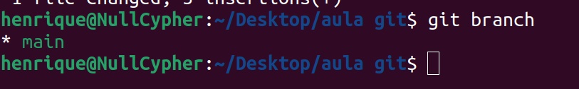
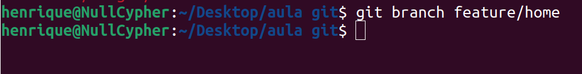
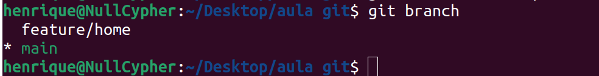
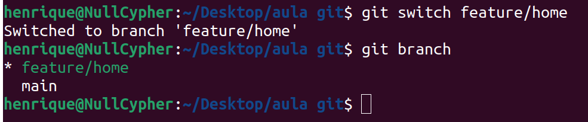
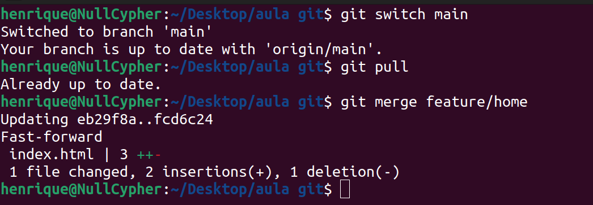
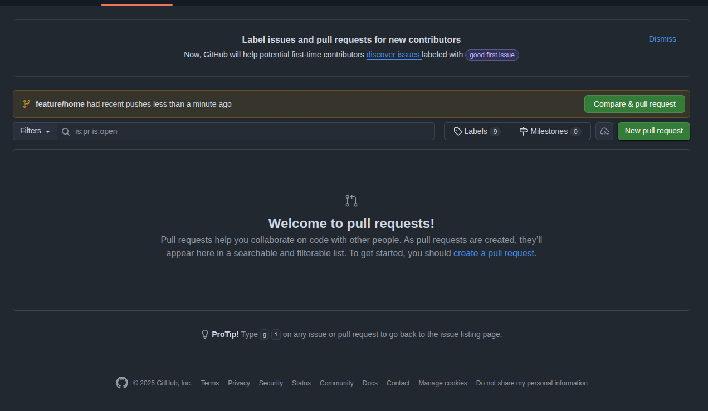
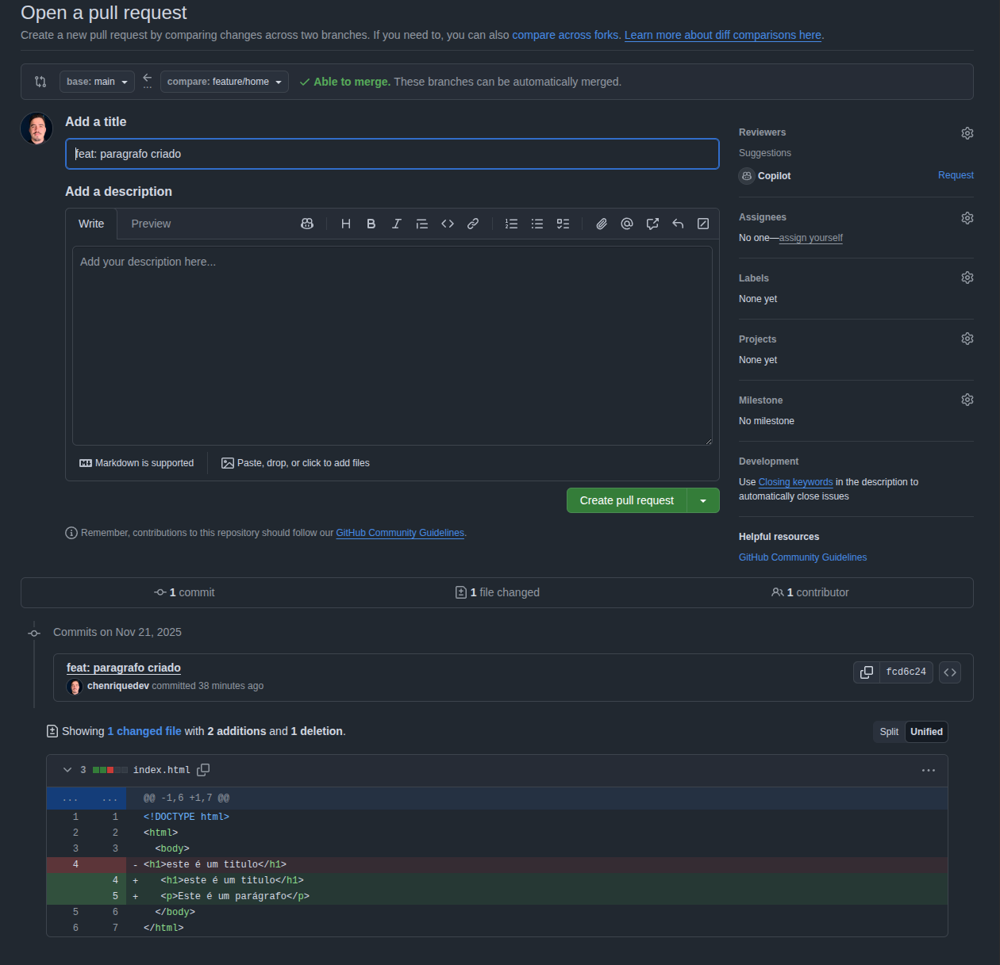
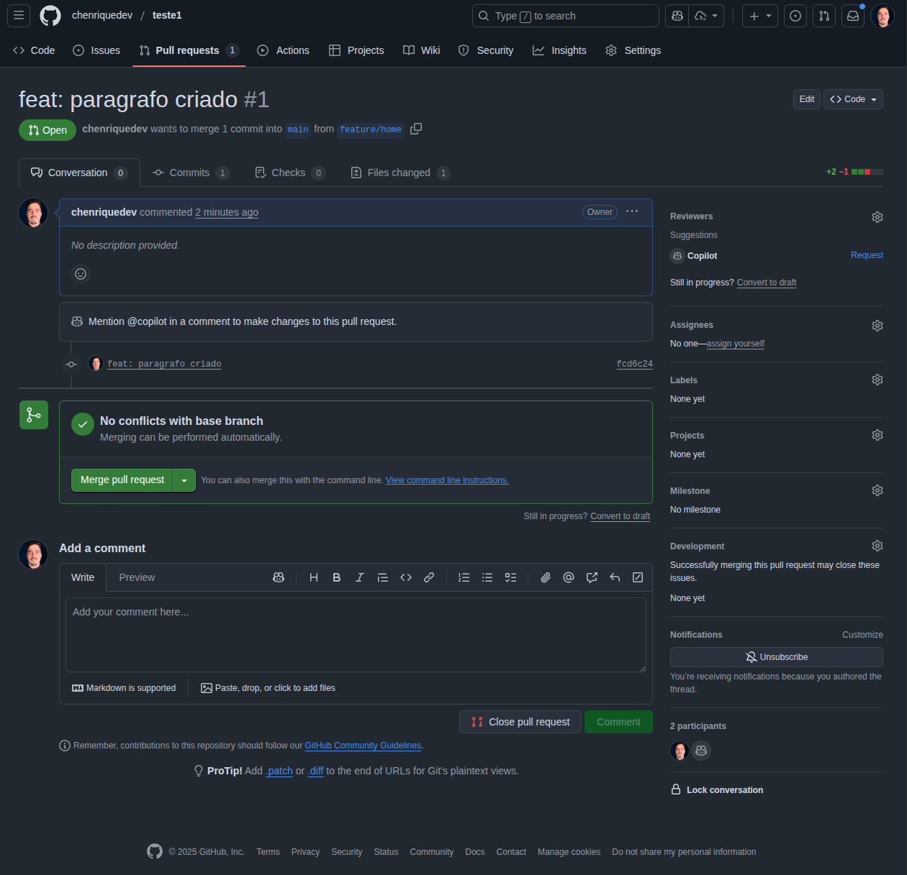

Durante o desenvolvimento de novas funcionalidades para o nosso site ou aplicativo, é normal que nós, desenvolvedores, criemos branches (ramificações) do código principal. Mas o que é Branch ?

Branch nada mais é que uma linha do tempo paralela para o desenvolvimento de novas features, correção de bugs de uma forma isolada.

Quando criamos o repositório no GitHub e ele nos deu um sequência de comandos para executar-mos e subir o código para ele, um dos comandos era o `git branch -M main`, esse comando renomeia a branch do nosso repositório local, pois geralmente ele se chama `master`.

Mas na real, pra que serve as branches ?

![[git-historico|700]]
*representação gráfica de uma linha do tempo do git*

De um modo simples e direto, branches são usadas para isolar o trabalho e garantir estabilidade. A branch `main` é a principal do projeto, que contém o código final e funcional. 

No diagrama apresentado, temos 3 branches no projeto: branch Main, Bugfix, Feature.

*A partir da branch main foi criado uma nova branch chamada `Bugfix`, pois foi constatado um bug na branch main que precisa ser resolvido. Quando o bug é resolvido e devidamente testado, a branch bugfix é implementada na branch principal*

*Os desenvolvedores descobriram um bug crítico no sistema que precisava ser resolvido com urgência. Com isso, a partir da branch main, eles criaram uma branch chamada de `Hotfix` com o mesmo intuito, não mexer diretamente na main para não bagunçar o código final. Assim que o bug é resolvido o código é aplicado na branch main*

*O mesmo ocorre para a branch `Feature`. Foi identificado a necessidade de implementar uma nova atualização para o sistema, e para não alterar diretamente a branch main essa branch foi criada. Assim que o novo recurso estiver pronto e devidamente testado ele é implementado na branch principal.*
 
 >[!WARNING] Atenção!
 >Nunca deve ser feito um comando push diretamente na branch main. Geralmente os repositórios remotos possuem regras para evitar este tipo de erro.

Os nomes das branches não são escolhidos por acaso, eles seguem um padrão de nomes semânticos. É apenas uma boa prática.

- **docs**: apenas mudanças de documentação;
- **feat ou feature**: uma nova funcionalidade;
- **bugfix/hotfix**: a correção de um bug;
- **perf**: mudança de código focada em melhorar performance;
- **refactor**: mudança de código que não adiciona uma funcionalidade e também não corrigi um bug;
- **style**: mudanças no código que não afetam seu significado (espaço em branco, formatação, ponto e vírgula, etc);
- **test**: adicionar ou corrigir testes.

### Manipulação de branches

Quando iniciamos um novo repositório local vimos que ele vem automaticamente com a branch `master`. Para verificarmos as branches existentes usamos o comando `git branch`.

	

Nesse exemplo, o git nos informa que existe apenas a branch `main`.

>[!NOTE] Observação
>Para ver as tanto as branches locais quanto as remotas, usamos a flag -a, e o comando fica assim: `git branch -a`

Para criar uma nova branch utilizamos o mesmo comando anterior `git branch`, mas passamos um nome para essa branch.

	

Para verificar se a branch realmente foi criada, basta usar o comando anterior `git branch`

	

Pronto, temos nossa branch `feature/home` criada.

### Navegando pelas branches

Agora que criamos a branch `feature/home`, o próximo passo é navegar até ela. O comando que nos permite acessar a nova branch é `git switch nome-da-branch`. E para verificar se funcionou, use o comando `git branch`

	

Pronto, a partir de agora, todas as modificações feitas em `feature/home` **NÃO** afetarão o código da branch principal, a `main`. Podemos trabalhar livremente em cima dessa branch e quando finalizar, enviar o novo código para a branch `main`.

### Integrando o trabalho de uma branch em outra

Por fim, após trabalhar na branch que criamos e finalizarmos o propósito dela, chegou o momento de incluir essas modificações na branch principal. Para isso, seguiremos um fluxo simples, principalmente se estivermos trabalhando de forma cooperativa.

Primeiro, devemos voltar para a branch principal, a fim de puxar novas atualizações, pois lembre-se, existem outras pessoas trabalhando no mesmo projeto.

>[!WARNING] Atenção!
>Para continuar aqui você já deve ter salvo o arquivo no git e commitado

	

*O que aconteceu aqui ?  Nós estávamos na branch `feature/home` e desejamos enviar as atualizações para a branch main. Para isso, mudamos para a branch `main` e puxamos as atualizações. Nesse caso não existiu novas atualizações. Com isso, o passo seguinte foi usar o comando `git merge <nome-da-branch>` para trazer todas as atualizações para a branch `main`. Após seguir esse fluxo, poderia seguir com o comando `git push` para salvar o hist *

### Fluxo real que é geralmente usado nas empresas

![[Drawing 2025-11-21 16.02.12.excalidraw | 1000]]

Nesse exemplo, o código inicia na branch main e já é criado uma branch chamada de `develop` onde todas as novas alterações do projeto devem ficar antes de irem para a branch final.

Para criar uma nova funcionalidade, devemos criar uma nova branch, a partir da branch `develop` chamada `feature/nomeDaFuncionalidade`. Quando a criação da nova feature é concluída e devidamente testada, o código da branch `feature` é enviado para a branch `develop`, onde seguirá para uma nova branch chamada de `release`, para que o código seja devidamente analisado e testado.

No exemplo acima, o código que chegou na branch `release` possuía um bug, por isso se fez necessário criar uma nova branch chamada `bugfix/nomeDoBug` para que pudesse ser corrigida.

Após ser corrigido, o código é enviado novamente para a branch `develop`, para que seja novamente enviado para a branch `release`, e se tudo tiver certo, ser enviado para a branch `Main`.

> [!QUESTION]
> Mas como eu envio o código da branch release para a main se eu não posso usar o git push diretamente na branch main?

Ai que entra um novo processo durante o desenvolvimento do projeto. O Pull Request.

### Pull Request

Quando criamos uma nova feature, para enviar o código corretamente para a branch `develop` nós não usamos o comando `git merge`, como vimos anteriormente. O fluxo segue para o GitHub, onde lá iremos iniciar a solicitação de Pull Request, para que um administrador analise o código para dizer se o código pode ser aprovado ou não. 

Para fazer isso basta seguir o fluxo no **GitHub**: profile (perfil) -> repositories (repositórios) -> entrar no repositório -> clicar em Pull Request.

	

O GitHub vai avisar que tem outra branch e se você quer comparar e seguir com o pull request, clicamos no botão.

	

Na tela ele vai pedir um título e uma descrição para aquele pull request, e logo abaixo vai mostrar todas as modificações realizadas.

Para finalmente criar a solicitação, basta clicar no botão "Create pull request", que um administrador do projeto vai aprovar ou rejeitar seu pr.

	

Se tudo estiver certo, e o pull request for aprovado, basta você clicar em Merge pull request e pronto. E para puxar essa atualização para a branch correta na nossa máquina, basta mudar para a branch em questão e usar o comando que já nos foi apresentado aqui, o `git pull`.